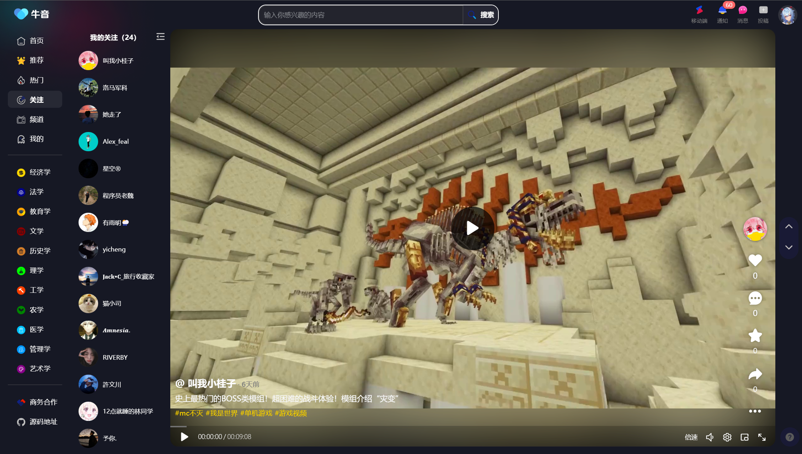

# 芝士学爆 - 短视频学习平台 🎓

## 项目简介

芝士学爆是一个基于Spring Cloud微服务架构的短视频学习平台，旨在通过短视频形式提供高效、便捷的学习体验。平台结合了现代化的技术栈和AI智能功能，为学生、职场人士及其他用户提供轻松、互动、高效的学习方式。

## 技术架构

### 🏗️ 微服务架构设计

本项目采用Spring Cloud微服务架构，具有以下特点：

- **服务治理**：基于Nacos实现服务注册与发现
- **API网关**：Spring Cloud Gateway提供统一入口和路由
- **服务间通信**：Feign + Dubbo双重通信机制
- **配置管理**：Nacos配置中心统一管理
- **熔断降级**：Sentinel实现服务容错保护

### 🛠️ 核心技术栈

| 技术分类 | 技术选型 | 版本 | 说明 |
|---------|---------|------|------|
| 基础框架 | Spring Boot | 3.4.5 | 微服务基础框架 |
| 微服务 | Spring Cloud | 2024.0.1 | 微服务治理 |
| 服务治理 | Spring Cloud Alibaba | 2023.0.3.2 | 阿里生态支持 |
| RPC框架 | Dubbo | 3.3.0 | 高性能RPC通信 |
| 数据库 | MySQL | 8.0.31 | 关系型数据库 |
| 连接池 | Druid | 1.2.24 | 数据库连接池 |
| ORM框架 | MyBatis Plus | 3.5.5 | 数据持久层 |
| 缓存 | Redis | - | 分布式缓存 |
| 搜索引擎 | Elasticsearch | 8.x | 全文搜索 |
| 消息队列 | RabbitMQ | - | 异步消息处理 |
| 文件存储 | 阿里云OSS/七牛云 | - | 对象存储服务 |
| 视频处理 | FFmpeg | 3.0.1 | 视频转码处理 |
| 短信服务 | 阿里云SMS | - | 短信验证码 |
| AI集成 | Spring AI | - | 智能聊天功能 |
| 工具库 | Hutool | 5.8.11 | Java工具集 |
| JSON处理 | FastJSON | 2.0.34 | JSON序列化 |
| 认证授权 | JWT | 0.9.1 | 用户认证 |
| 容器化 | Docker | - | 应用容器化 |

## 📁 项目结构

```
niuyin-ai/
├── docker/                    # Docker部署配置
│   ├── mysql/                 # MySQL容器配置
│   ├── redis/                 # Redis容器配置
│   ├── niuyin/               # 应用容器配置
│   └── docker-compose.yml    # 容器编排文件
├── niuyin-common/            # 公共模块
│   ├── niuyin-common-core/   # 核心工具类
│   ├── niuyin-common-cache/  # 缓存组件
│   └── niuyin-common-ai/     # AI相关公共类
├── niuyin-dubbo/             # Dubbo服务接口
├── niuyin-feign/             # Feign远程调用
├── niuyin-gateway/           # API网关
├── niuyin-model/             # 数据模型定义
├── niuyin-service/           # 业务服务模块
│   ├── niuyin-service-ai/    # AI聊天服务
│   ├── niuyin-service-member/ # 用户服务
│   ├── niuyin-service-video/  # 视频服务
│   ├── niuyin-service-social/ # 社交服务
│   ├── niuyin-service-behave/ # 行为分析服务
│   ├── niuyin-service-search/ # 搜索服务
│   ├── niuyin-service-recommend/ # 推荐服务
│   ├── niuyin-service-creator/ # 创作者中心
│   └── niuyin-service-notice/ # 通知服务
├── niuyin-starter/           # 自动配置模块
│   ├── niuyin-starter-file/  # 文件存储
│   ├── niuyin-starter-sms/   # 短信服务
│   └── niuyin-starter-video/ # 视频处理
├── niuyin-tools/             # 工具模块
│   └── niuyin-tools-es/      # ES工具封装
└── pom.xml                   # Maven父项目配置
```

## 🚀 核心功能模块

### 1. 🎬 视频服务 (niuyin-service-video)

**核心功能：**
- 视频上传与存储（支持阿里云OSS和七牛云）
- 视频转码处理（基于FFmpeg）
- 视频分片上传
- 视频分类管理
- 视频标签系统
- 视频封面自动生成
- 视频信息管理
- 相关视频推荐

**技术特色：**
- 支持多种视频格式转码
- 自动生成视频封面截图
- 分布式文件存储
- 视频元数据提取

### 2. 👥 用户服务 (niuyin-service-member)

**核心功能：**
- 用户注册与登录
- 短信验证码登录
- 用户信息管理
- 头像上传
- 密码管理
- 用户认证与授权
- 登录策略模式

**技术特色：**
- JWT令牌认证
- 多种登录方式（用户名密码、手机验证码）
- 策略模式实现登录逻辑
- 用户信息缓存优化

### 3. 🤝 社交服务 (niuyin-service-social)

**核心功能：**
- 用户关注与取消关注
- 粉丝管理
- 关注动态推送
- 社交关系维护
- 动态时间线

**技术特色：**
- 推拉结合的动态分发
- Redis实现关注关系缓存
- 异步消息通知

### 4. 📊 行为分析服务 (niuyin-service-behave)

**核心功能：**
- 视频点赞/取消点赞
- 视频收藏管理
- 评论系统（支持回复）
- 用户行为数据统计
- 观看历史记录

**技术特色：**
- 实时行为数据更新
- 分布式锁防重复操作
- 异步行为数据同步

### 5. 🔍 搜索服务 (niuyin-service-search)

**核心功能：**
- 视频全文搜索
- 用户搜索
- 搜索建议与补全
- 搜索历史管理
- IK分词器支持

**技术特色：**
- Elasticsearch全文检索
- 智能搜索建议
- 搜索结果高亮
- 多字段联合搜索

### 6. 🎯 推荐服务 (niuyin-service-recommend)

**核心功能：**
- 个性化视频推荐
- 热门视频推荐
- 基于兴趣的内容推送
- 推荐算法优化

**技术特色：**
- 多维度推荐算法
- 用户画像分析
- 实时推荐更新

### 7. 🤖 AI聊天服务 (niuyin-service-ai)

**核心功能：**
- 智能对话系统
- 流式消息返回
- 对话上下文管理
- 知识库问答
- 多模型支持

**技术特色：**
- Spring AI框架集成
- 流式响应优化用户体验
- 支持多种AI模型
- 知识库RAG检索

### 8. 🎨 创作者中心 (niuyin-service-creator)

**核心功能：**
- 内容创作管理
- 视频合集管理
- 创作数据统计
- 素材库管理

### 9. 🔔 通知服务 (niuyin-service-notice)

**核心功能：**
- 系统消息推送
- 互动消息通知
- 消息队列处理

### 10. 🌐 API网关 (niuyin-gateway)

**核心功能：**
- 请求路由与转发
- 统一认证与鉴权
- 限流与熔断
- 跨域处理
- 请求日志记录

**技术特色：**
- JWT令牌验证
- 自定义过滤器链
- 动态路由配置
- 异常统一处理

## 🛠️ 技术组件

### 文件存储组件 (niuyin-starter-file)
- 支持阿里云OSS和七牛云存储
- 自动配置文件上传服务
- 多种文件类型支持
- 分片上传功能

### 短信服务组件 (niuyin-starter-sms)
- 阿里云短信服务集成
- 多种短信模板支持
- 验证码生成与验证

### 视频处理组件 (niuyin-starter-video)
- FFmpeg视频处理
- 视频信息提取
- 封面图生成
- 视频格式转换

### Elasticsearch工具 (niuyin-tools-es)
- ES客户端封装
- 索引管理工具
- 查询构建器

## 🎯 业务特色

### 1. 智能推荐算法
- 基于用户行为的协同过滤
- 内容特征分析
- 实时推荐策略调整

### 2. 社交化学习
- 关注机制增强用户粘性
- 互动评论促进交流
- 学习社区氛围营造

### 3. AI辅助学习
- 智能问答系统
- 个性化学习建议
- 知识点关联推荐

### 4. 多媒体支持
- 高质量视频处理
- 自动生成封面
- 多格式兼容

## 🚀 快速开始

### 环境要求
- JDK 17+
- Maven 3.6+
- MySQL 8.0+
- Redis 6.0+
- Elasticsearch 8.x
- Docker & Docker Compose

### 本地开发

1. **克隆项目**
```bash
git clone <repository-url>
cd niuyin-ai
```

2. **启动基础服务**
```bash
# 使用Docker Compose启动MySQL、Redis等基础服务
docker-compose -f docker/docker-compose.yml up -d
```

3. **构建项目**
```bash
mvn clean package -DskipTests
```

4. **启动服务**
```bash
# 依次启动各个服务模块
mvn spring-boot:run -pl niuyin-gateway
mvn spring-boot:run -pl niuyin-service/niuyin-service-member
mvn spring-boot:run -pl niuyin-service/niuyin-service-video
# ... 其他服务
```

### Docker部署

```bash
# 构建并启动所有服务
docker-compose -f docker/docker-compose.yml up -d
```

## 📱 运行效果

### 首页


### 推荐页面


### 热门视频


### 关注动态


### 个人中心


### 分类浏览


### 搜索功能


### 全屏播放


## 🔧 配置说明

### 数据库配置
```yaml
spring:
  datasource:
    driver-class-name: com.mysql.cj.jdbc.Driver
    url: jdbc:mysql://localhost:3306/niuyin_short_video_dev
    username: root
    password: your_password
```

### Redis配置
```yaml
spring:
  data:
    redis:
      host: localhost
      port: 6379
      password: your_password
```

### 文件存储配置
```yaml
# 阿里云OSS
aliyun:
  oss:
    endpoint: your_endpoint
    bucketName: your_bucket
    accessKeyId: your_access_key
    accessKeySecret: your_secret

# 七牛云
qiniu:
  oss:
    accessKey: your_access_key
    secretKey: your_secret_key
    bucket: your_bucket
```

## 🤝 贡献指南

1. Fork项目
2. 创建特性分支 (`git checkout -b feature/AmazingFeature`)
3. 提交更改 (`git commit -m 'Add some AmazingFeature'`)
4. 推送到分支 (`git push origin feature/AmazingFeature`)
5. 打开Pull Request

## 📄 许可证

本项目采用MIT许可证 - 查看 [LICENSE](LICENSE) 文件了解详情


## 🙏 致谢

感谢所有为本项目做出贡献的开发者，以及提供技术支持的开源社区。

---

⭐ 如果这个项目对你有帮助，请给我们一个星标！
