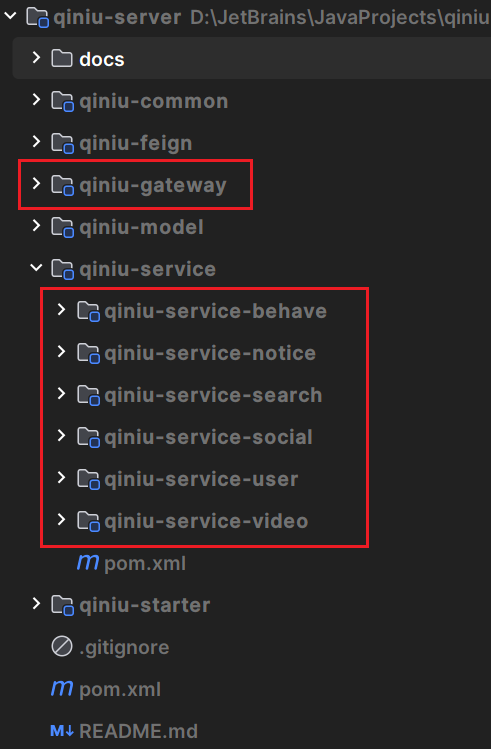

# 首先声明：

本项目各种环境均已在服务器部署！
本项目各种环境均已在服务器部署！
本项目各种环境均已在服务器部署！

# 后端部署

无需关心各种环境配置，打开项目启动即用！

首先切换到`main`分支

所以运行本项目只需要启动各服务启动类即可，所有启动类如下图：
点击对应`application`启动类即可。


# 前端部署

前端项目地址：https://github.com/threesome-qiniu/qiniuyun-Develop-

`clone`到本地之后，执行包安装命令：

```shell
npm i
```
执行启动命令：
```shell
npm run dev
```
执行成功后打开网址：http://127.0.0.1:5173/index 即可访问。

登录账号密码：
```shell
账号：roydon
密码：qwer1234
```
# 运行demo

http://s38bf8bdn.hb-bkt.clouddn.com/niuyin14e02b825375491f8604175a48dd142evideo.mp4
